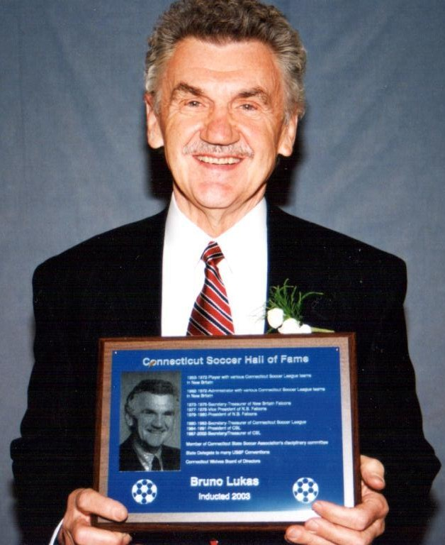

## eulogy for my grandfather

*Delivered at his funeral service at Holy Cross Church in New Britain, CT on April 28, 2023*

Over the past week, it’s been hard to avoid taking inventory of my memories of my grandpa. I even tried to make the process useful — to identify a “reason” for a particularly difficult memory, or use a particularly joyful one as a counterweight to my grief. But this did not make anything more *whole* — choosing between parts of who he was left me with an incomplete picture of the man I was lucky to have as my grandfather. Taking inventory, to borrow his phraseology, is immaterial. The difficulties and joys are one. Markers on the continuum which manifested as Grandpa.

So, the challenge has been to sit with whatever comes up and to be thankful for it. The interplay of his personality and his soul, his circumstances and his choices, what he sacrificed and what he asked of us. Every part of him must be allowed equal presence in the memories that we carry forward.

As a life-long learner, he always valued deeper and more precise understanding — he met everyone and every situation with immense energy and an invitation for debate. He taught me that if the pursuit of knowledge comes from a place of obsession or infatuation, you will only find validation of what you already know. Rather, his was a model of usefully-applied *compulsion* toward what he did not yet understand. This rigor created the foundation for a lot of our time together, exploring the oft-changing world of technology. I’m still so thankful for his taking a risk to place a 10 year old at the helm of an expensive piece of equipment, and for his sincere interest in asking me thoughtful questions about user interfaces and system design, while writing down every step we fumbled through together.

In every aspect of his life, his dedication to learning as a tool for self-betterment usually softened the harder edges of his personality — he valued the admission of not knowing as a **starting point**. He often gave room for struggle, because he knew that one’s continued pursuit despite hardship indicates that a problem is worth solving. I remember hundreds of conversations about my choices, which all started with a focus on the temporal — money, questions of success, potential for loss. And whether intentional or not, I eventually realized that what he was doing was asking me to stick to my guns, to double-down on what I felt was important. And though he always shared his sometimes brutal opinions, more often than not he offered them as a litmus — a small, controlled dose of what he knew was out there waiting for the over-eager and under-prepared. He wanted to ensure that those he cared for got practice overcoming the challenges that he had faced in his own pursuit of purpose.

And this was this form of love that was illegible to me, until he started writing his biography. The final document, which totals 89 pages, is a map of an impossible journey — a childhood stolen by war, a young adulthood spent being othered in a new land, and continuous testing of his mental and spiritual strength. As I read, I was forced to integrate this new information *alongside* my memories, not as an either/or but a both/and. This helped me arrive at a sense of overwhelming gratitude for the man he worked so hard to become.

In its last paragraph, he writes “All things have to die. It is a part of life. But what will happen to me when I die? This is my biggest curiosity. I can’t find an answer. It is unknowable.”

Speaking openly and full-heartedly with him over the past few months, across a divide of several years of silence, I found myself wondering the same. What would happen to the person I was lucky to love as my grandfather when he was no longer in his body?

When I learned that he’d passed, I sat with this question. I sat with the spaces in my soul where I felt my love for him, where I’d always kept him close despite the distance. Beyond all appearances, beyond all joy and pain. And I felt this part of me begin to welcome him, in a way that wasn’t possible before. I felt a bit of his light. A reflection from the infinity of spirit.

And the hardest part for me, and maybe for some of you, is that the acceptance of this *infinity* and the acceptance of what is *finite* are so inextricably linked. Pain continues to rise through that negotiation.

And while this is difficult, it also feels a bit like his characteristic pushback — some friction to help us refine and double-down. To continue learning in this life, so we’re ready to compare notes with him in the next.

